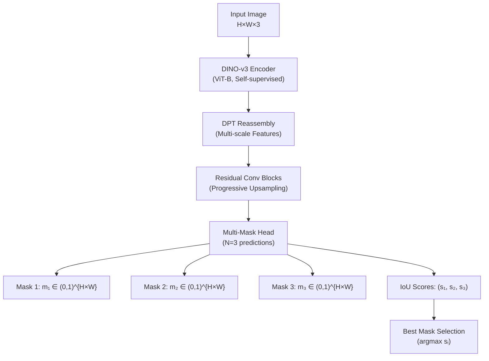
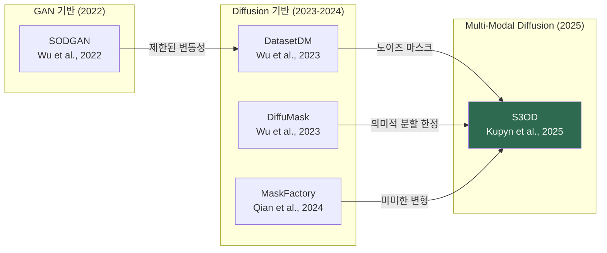

# S3OD: Towards Generalizable Salient Object Detection with Synthetic Data

> **논문 정보**
> - **제목**: S3OD: Towards Generalizable Salient Object Detection with Synthetic Data
> - **저자**: Orest Kupyn, Hirokatsu Kataoka, Christian Rupprecht
> - **발표**: ICLR 2026 (arXiv:2510.21605)
> - **코드/데이터셋**: [GitHub](https://github.com/KupynOrest/s3od) | HuggingFace (`okupyn/s3od_dataset`)
> - **프로젝트 페이지**: [s3odproject.github.io](https://s3odproject.github.io)

---

## 1. 핵심 주장 및 주요 기여 요약

### 핵심 주장
S3OD는 **Salient Object Detection(SOD)**이 본질적으로 **데이터 부족(data-bounded)** 문제에 의해 제한되고 있으며, 복잡한 모델 아키텍처가 아닌 **대규모 고품질 합성 데이터**와 **모호성 인식 아키텍처(ambiguity-aware architecture)**를 통해 **교차 데이터셋 일반화(cross-dataset generalization)** 성능을 극적으로 향상시킬 수 있다고 주장합니다.

### 주요 기여 (4가지)

| # | 기여 | 설명 |
|---|------|------|
| 1 | **Multi-Modal Dataset Diffusion Pipeline** | FLUX DiT 특징 맵, Concept Attention 맵, DINO-v3 특징을 결합하여 이미지-마스크 쌍을 동시 생성 |
| 2 | **Iterative Generation Framework** | 모델 약점 기반 피드백 루프를 통해 어려운 카테고리에 더 많은 샘플을 동적 할당 |
| 3 | **대규모 합성 데이터셋** | 139,000+ 고해상도 이미지 (기존 SOD 데이터셋 전체 합산 대비 131% 이상 규모) |
| 4 | **Ambiguity-Aware Multi-Mask Decoder** | 다중 마스크 예측을 통해 SOD 고유의 모호성을 자연스럽게 처리 |

---

## 2. 해결하고자 하는 문제

### 2.1 데이터 부족 문제
- SOD는 **픽셀 단위 정밀 주석(pixel-precise annotation)**이 필요하며, 단일 샘플 라벨링에 **최대 10시간** 소요
- 기존 데이터셋은 규모가 작아 (예: DIS-5K는 약 5,470장) 실세계 복잡성을 충분히 반영하지 못함
- SA-1B와 같은 대규모 데이터셋조차 고해상도 픽셀-정밀 데이터에는 한계

### 2.2 교차 도메인 일반화 실패
- 기존 접근법들은 DIS, HR-SOD 등 하위 태스크별로 **별도 모델을 학습**해야 함
- 소규모 데이터셋에 의한 **태스크-특화 과적합(task-specific overfitting)** 발생
- BiRefNet, MVANet 등 최신 아키텍처 혁신도 교차 도메인 일반화 미해결

### 2.3 주석의 모호성
- 서로 다른 주석자(annotator)가 동일 이미지의 현저성(saliency)을 다르게 해석
- **결정론적(deterministic)** 단일 출력 모델은 모호한 영역에서 평균화된 저신뢰도 예측 생성
- 여러 물체가 존재하는 복잡한 장면에서 "무엇이 현저한가"의 정의 자체가 불분명

### 2.4 기존 합성 데이터 접근법의 한계
- **Pseudo-labeling**: 교사 모델의 성능 상한에 제약됨
- **DatasetDM** (Wu et al., 2023a): 노이즈가 많은 불완전한 마스크, 복잡한 다중 객체 장면에서 실패
- **MaskFactory** (Qian et al., 2024): 편집된 마스크에 조건화하여 이미지 생성 → 학습 세트의 미미한 변형만 생성 가능
- **SODGAN** (Wu et al., 2022): GAN 기반 → 학습 데이터의 제한된 변동성으로 복잡한 장면 처리 불가

---

## 3. 제안하는 방법 (수식 포함)

### 3.1 모델 아키텍처 (S3ODNet)

S3ODNet은 **Dense Prediction Transformer (DPT)** (Ranftl et al., 2021) 아키텍처를 기반으로 하며, **DINO-v3 (ViT-B)** 가중치로 인코더를 초기화합니다.

**문제 정형화**: 입력 이미지에서 이진 마스크로의 매핑 함수:

$$f: \mathcal{I} \rightarrow \mathcal{M}, \quad \mathcal{I} \subset \mathbb{R}^{H \times W \times 3}, \quad \mathcal{M} = \{0, 1\}^{H \times W}$$

**다중 마스크 예측**: 최종 예측 헤드가 $N$개의 소프트 마스크를 출력:

$$(m_1, \ldots, m_N), \quad m_i \in (0, 1)^{H \times W}$$

**최적 예측 선택**: Multiple-Choice Learning (Guzman-Rivera et al., 2012)에서 영감을 받아, 학습 시 IoU 기준 최적 예측을 선택:

```math
i^* = \text*{arg\,min}_{i} \text{IoU}(m_i, y)
```

> [!NOTE]
> 여기서 $y \in \mathcal{M}$는 유일한 Ground Truth 주석이며, $\text{IoU}$는 예측 마스크와 GT 간의 Intersection-over-Union입니다.

**Relaxed Assignment Loss**: 사용되지 않는 브랜치의 퇴화를 방지하기 위한 지수적 감쇠 정규화:

$$\mathcal{L} = \mathcal{L}_{i^*} + \lambda e^{-\gamma t} \sum_{i}^{N} \mathcal{L}_i$$

| 하이퍼파라미터 | 값 | 역할 |
|---------------|---|------|
| $\lambda$ ($\lambda_{reg}$) | 0.1 | 초기 보조 브랜치 가중치 |
| $\gamma$ | 0.2 | 감쇠율 |
| $t$ | 현재 에폭 | 학습 진행도 |

**추론 시 마스크 선택**: 모델이 예측한 IoU 점수 $(s_1, \ldots, s_N)$ 중 최고 점수의 마스크를 선택합니다.

### 3.2 목적 함수 (Objective Function)

#### (1) Focal Loss — 전경/배경 클래스 불균형 처리

$$\mathcal{L}_{\text{focal}} = -\sum_{p} \left[ y(p) (1 - m_i(p))^\tau \log(m_i(p)) + (1 - y(p)) m_i(p)^\tau \log(1 - m_i(p)) \right]$$

여기서 $p$는 픽셀 인덱스, $\tau = 2$는 focusing parameter입니다.

#### (2) IoU Loss — 영역 수준 정확도

$$\mathcal{L}_{\text{IoU}} = 1 - \frac{\sum_p m_i(p) \cdot y(p)}{\sum_p m_i(p) + \sum_p y(p) - \sum_p m_i(p) \cdot y(p)}$$

#### (3) 마스크 손실 결합

$$\mathcal{L}_{\text{mask}} = \lambda_{\text{mask}} \mathcal{L}_{\text{focal}} + \mathcal{L}_{\text{IoU}}, \quad \lambda_{\text{mask}} = 10$$

#### (4) IoU Score Loss — 추론 시 최적 마스크 선택을 위한 감독

$$\mathcal{L}_{\text{score}} = \frac{1}{N} \sum_{i=1}^{N} (s_i - \text{IoU}(m_i, y))^2$$

#### (5) 최종 학습 목적 함수

$$\mathcal{L}_{\text{total}} = \mathcal{L}_{\text{mask}}^{i^*} + \lambda_{\text{score}} \mathcal{L}_{\text{score}} + \lambda_{\text{reg}} e^{-\gamma t} \sum_{i}^{N} \mathcal{L}_{\text{mask}}^{i}$$

| 하이퍼파라미터 | 값 |
|---------------|---|
| $\lambda_{\text{score}}$ | 0.05 |
| $\lambda_{\text{reg}}$ | 0.1 |
| $\gamma$ | 0.2 |
| $N$ (마스크 수) | 3 |

### 3.3 Multi-Modal Dataset Diffusion Pipeline

#### (a) DiT Feature Maps 추출
FLUX DiT의 **38개 single-stream 트랜스포머 블록** 중 4개 레이어 $\{4, 16, 27, 36\}$에서 특징 맵 추출:

$$\mathbf{F}_{\text{DiT}} \in \mathbb{R}^{B \times L_I \times 3072}, \quad L_T = 512$$

이미지 토큰만 추출 후 학습된 프로젝션으로 768차원으로 축소합니다.

#### (b) Concept Attention Maps
Concept token $c$와 이미지 패치 $x$ 간의 attention 계산:

$$A(x, c) = \frac{\mathbf{o}_x \cdot \mathbf{o}_c}{|\mathbf{o}_x| \cdot |\mathbf{o}_c|}$$

여기서 $\mathbf{o}_x$, $\mathbf{o}_c$는 multi-modal 트랜스포머 레이어의 attention 출력 벡터입니다. 각 샘플에 대해 두 개의 concept attention 맵 추출:

$$\{A_{\text{object}}, A_{\text{background}}\}$$

#### (c) DINO-v3 Visual Features
생성된 이미지에서 DINO-v3 (ViT-L)을 통해 세밀한 시각적 의미론적 특징 추출합니다.

#### (d) Multi-Modal Fusion
세 모달리티를 256차원 공통 공간으로 프로젝션 → 채널 방향 연결 → 2단계 합성곱 네트워크($3 \times 3$ → $1 \times 1$) → DINO-v3 특징과 잔차 결합 → DPT 디코더로 전달합니다.

### 3.4 Iterative Data Synthesis

$r$번째 라운드 학습 후 카테고리 $c_i$에 대해 성능 점수 $\kappa(I_j)$를 계산합니다 (다양한 이미지 변환에 대한 평균 IoU). 카테고리 평균 점수 $\bar{\kappa}_i$를 구한 후, 다음 라운드 가중치를 비선형 스케일링 함수로 업데이트:

$$w_i^{(r+1)} = w_{\min} + w_{\text{new}} \cdot e^{-\alpha(\bar{\kappa}_i - \beta)}$$

| 매개변수 | 값 | 설명 |
|---------|---|------|
| $\alpha$ | 8 | 성능 기반 편향 강도 |
| $\beta$ | 0.5 | 임계값 |
| $w_{\min}$ | $\frac{1}{\mathcal{C}}$ | 최소 클래스 가중치 |
| $w_{\text{new}}$ | $\frac{4}{\mathcal{C}}$ | 최대 초과 가중치 |

이 함수는 점수가 임계값 이하인 카테고리의 가중치를 증가시키면서, 성능이 좋은 카테고리에도 최소 가중치를 유지합니다.

### 3.5 Multi-Stage Quality Filtering

| 단계 | 방법 | 기준 |
|------|------|------|
| **Consistency Filtering** | 원본 vs 수평 뒤집기 예측의 IoU 비교 | $\tau = 0.8$ 미만 필터링 |
| **Mask Quality Assessment** | Gemma-3 VLM으로 마스크 품질 평가 | $\leq 5$개 주요 컴포넌트 |
| **Semantic Validation** | Gemma VLM으로 의미적 정확성 검증 | 주요 객체의 $> 70\%$ 커버리지 |

전체 생성 샘플의 **6.8%**가 필터링으로 제거됩니다.

---

## 4. 모델 구조 상세



**주요 설계 특징:**
- **Backbone**: DINO-v3 (ViT-B) — 대규모 자기지도학습(self-supervised learning)을 통한 강건한 시각적 표현
- **Decoder**: DPT 기반 다중 스케일 특징 재조립(reassembly) → 잔차 합성곱 블록을 통한 점진적 업샘플링
- **Multi-Mask Head**: 3개의 마스크 후보 + IoU 점수 예측
- BiRefNet/MVANet 대비 **단순화된 아키텍처** (다중 뷰 융합, 반복 정제 모듈 없음)

---

## 5. 성능 향상

### 5.1 평가 지표

| 지표 | 수식/설명 |
|------|----------|
| $F_{1\text{max}}$ | 최대 F-측정치, $F_\beta = \frac{(1+\beta^2) \cdot \text{Precision} \cdot \text{Recall}}{\beta^2 \cdot \text{Precision} + \text{Recall}}$, $\beta^2 = 0.3$ |
| MAE | 평균 절대 오차: $\text{MAE} = \frac{1}{H \times W} \sum_{p} (m(p) - y(p))$ |
| $S_\alpha$ | 구조 유사도: $S_m = \alpha \cdot S_o + (1-\alpha) \cdot S_r$ , $\alpha = 0.5$ |
| $E^{\Phi}_{M}$ | 향상된 정렬 측정: 지역/전역 유사도 결합 |

### 5.2 교차 데이터셋 일반화 (Cross-Dataset Generalization)

> [!IMPORTANT]
> 이것이 S3OD의 **가장 핵심적인 결과**입니다. 합성 데이터만으로 학습한 모델이 실제 데이터 학습 모델 대비 극적인 일반화 향상을 달성합니다.

**합성 데이터만으로 학습 시 MAE 감소율** (DIS-5K 학습 모델 대비):

| 벤치마크 | MAE 감소율 |
|---------|-----------|
| HRSOD-TE | **50.0%** |
| DUTS-TE | **46.7%** |
| DUT-OMRON | **20.7%** |
| UHRSD | **42.9%** |
| DAVIS-S | **34.4%** |

### 5.3 State-of-the-Art 비교 (Fine-tuned)

**DIS-5K 벤치마크 오류율 감소** (기존 SOTA 대비):
- $F_{1\text{max}}$: **14.0%** 오류 감소
- MAE: **7.3%** 오류 감소  
- $S_\alpha$: **20.6%** 오류 감소
- $E^{\Phi}_{M}$: **17.1%** 오류 감소

**DUT-OMRON (일반화 테스트)** — BiRefNet 대비 오류율 감소:
- $F_{1\text{max}}$: **24.8%**, MAE: **13.6%**, $S_\alpha$: **26.9%**, $E^{\Phi}_{M}$: **15.8%**

### 5.4 Camouflaged Object Detection (COD)으로의 전이

| 벤치마크 | S3OD $F_m$ | BiRefNet $F_m$ |
|---------|-----------|---------------|
| COD10K | **0.911** | 0.888 |
| NC4K | **0.923** | 0.909 |

> [!TIP]
> S3OD는 합성 데이터만으로 학습해도 일부 COD 전용 학습 모델(Huang et al., 2023)보다 높은 성능을 달성합니다.

### 5.5 합성 데이터 품질 비교

| 지표 | S3OD | MaskFactory | DatasetDM |
|------|------|-------------|-----------|
| Inception Score | **35.19** | 17.41 | 14.97 |
| FID | **1.74** | 2.81 | 3.16 |

### 5.6 Ablation Study 주요 결과

- **Multi-modal fusion**: 세 모달리티 모두 결합 시 최적 성능 (단일 모달리티 부족)
- **DINO-v3 vs Swin-B backbone**: DINO-v3가 유의하게 우수
- **다중 마스크 (N=3)**: 최적 성능 달성
- **Iterative generation**: DIS에서 $F_m$ 3.6% 향상, DUT-OMRON에서 5.3% 향상
- **LLM 생성 프롬프트**: Inception Score 44.7% 증가 (단순 클래스명 대비)
- **보조 손실 감쇠**: $\lambda_{reg}=0.0$이면 브랜치 붕괴 발생, 정적 정규화($\gamma=0.0$)이면 모든 마스크가 유사해짐

---

## 6. 한계 (Limitations)

> [!WARNING]
> 저자들이 명시적으로 인정한 한계와 추가적으로 분석된 한계입니다.

1. **합성 데이터 아티팩트**: 다단계 필터링에도 불구하고, 간헐적으로 마스크가 객체를 완전히 커버하지 못하거나 명확한 현저 객체가 없는 장면이 생성될 수 있음
2. **높은 계산 비용**: 12B 파라미터 FLUX DiT를 사용한 대규모 데이터 생성의 계산 비용이 상당함 (수동 라벨링보다는 빠르지만 병렬화 필요)
3. **벤치마크 포화**: UHRSD, DAVIS-S 등 일부 HR-SOD 벤치마크에서는 트랜스포머 기반 방법들이 이미 비슷한 성능에 도달 → 의미 있는 비교가 어려움
4. **테스트 세트 미제공**: 합성 데이터의 특성상 S3OD 데이터셋에 별도 테스트 분할을 제공하지 않음 (실제 사람 주석 데이터로 평가해야 함)
5. **모호성 정의의 제한**: 다중 마스크 예측이 모호성을 처리하지만, "현저성"의 정의 자체에 대한 근본적 해결은 아님
6. **확산 모델 편향**: FLUX 모델이 생성할 수 있는 이미지 분포에 의해 합성 데이터의 다양성이 간접적으로 제한

---

## 7. 일반화 성능 향상 가능성 — 심층 분석

### 7.1 일반화 향상의 핵심 메커니즘

#### (a) 대규모 다양한 합성 데이터의 역할
- **규모의 효과**: 139,000+ 이미지는 기존 모든 SOD 학습 데이터셋의 합(약 60,000장)보다 131% 이상 큼
- **다양성**: ImageNet 분류 체계에서 카테고리 샘플링 → 실세계 객체/활동의 광범위한 커버리지
- **LLM 기반 프롬프트**: 장면 구성, 객체 크기, 위치, 가림(occlusion), 조명 조건, 환경 복잡성을 체계적으로 변형
- **도메인 갭 최소화**: FLUX-Krea 체크포인트 (대규모 강화학습으로 사실주의 정렬) + 포괄적 이미지 증강

#### (b) Multi-Modal Supervision의 상호 보완성
세 가지 특징 소스의 상호 보완적 역할:

| 특징 소스 | 강점 | 약점 |
|----------|------|------|
| **Concept Attention** | 명확한 전경/배경 분리 | 복잡한 장면에서 정밀 위치 지정 실패 |
| **DINO-v3** | 세밀한 시각적 의미론, 객체 수준 이해 | 생성 이미지에 대한 학습/테스트 분포 갭 |
| **FLUX DiT** | 공간 장면 파싱, 경계 위치, 구조적 구성 | 단독으로 고해상도 마스크 디코딩 불가 |

복잡하고 모호한 장면에서 **생성적(generative) 특징과 판별적(discriminative) 특징이 서로 보완**하여 고품질 마스크를 디코딩합니다.

#### (c) Iterative Generation의 적응적 학습
- **피드백 루프**: 모델 성능이 낮은 카테고리에 자동으로 더 많은 샘플 할당
- **3라운드 반복**: R1(카테고리당 100장) → R2, R3(각 25,000장, 어려운 카테고리 우선)
- DIS 벤치마크에서 $F_m$ 3.6%, DUT-OMRON에서 5.3% 추가 향상

#### (d) Ambiguity-Aware Architecture
- 다중 마스크 예측으로 **모호한 GT 주석에 대한 평균화 효과 회피**
- Oracle 평가(3개 마스크 중 GT와 최적 매칭)가 표준 평가보다 유의하게 높은 성능 → 주석의 본질적 모호성 확인
- 실용적 응용에서 사용자가 다중 해석 중 선택 가능

#### (e) Foundation Model 활용
- DINO-v3 백본: 대규모 자기지도학습으로 얻은 범용적 시각적 표현
- Swin-B 대비 유의한 성능 향상 → **사전학습 표현의 품질이 일반화에 직결**

### 7.2 교차 태스크 통합 (Unified High-Fidelity Salient Segmentation)
S3OD는 DIS, HR-SOD, SOD를 **단일 태스크("high-fidelity salient segmentation")**로 통합하려는 시도입니다. 이는 태스크별 모델 학습의 비효율성을 해소하고, 단일 모델로 다양한 벤치마크에서 일반화를 달성하는 것을 목표로 합니다.

### 7.3 향후 일반화 향상 가능 방향

1. **더 큰 합성 데이터셋**: 현재 139K → 수백만 규모로 확장 시 추가 일반화 가능성
2. **다중 도메인 합성**: 의료, 위성, 수중 이미지 등 특수 도메인 포함
3. **더 강력한 백본**: ViT-L/ViT-H 또는 차세대 foundation model 활용
4. **동적 마스크 수**: 장면 복잡도에 따라 $N$을 적응적으로 조절
5. **비디오 확장**: 시간적 일관성을 고려한 합성 비디오 데이터 생성

---

## 8. 향후 연구에 미치는 영향 및 고려사항

### 8.1 연구 패러다임 전환

> [!IMPORTANT]
> S3OD는 SOD 분야에서 **"모델 복잡도 증가 → 데이터 스케일링"**으로의 패러다임 전환을 명확히 제시합니다.

1. **데이터 중심 AI(Data-Centric AI)의 실증**: 단순한 아키텍처 + 대규모 고품질 데이터가 복잡한 아키텍처를 능가할 수 있음을 입증
2. **합성 데이터의 실용성 검증**: 합성 데이터만으로도 실세계 벤치마크에서 경쟁력 있는 성능 달성 가능
3. **교차 데이터셋 일반화 평가의 중요성**: 기존의 단일 벤치마크 과적합 평가 방식에 대한 근본적 재고 제안

### 8.2 타 분야로의 확장 가능성

- **Camouflaged Object Detection (COD)**: S3OD가 제로샷으로도 강한 성능 입증 → 합성 데이터 전이 학습의 범용성
- **기타 Dense Prediction Tasks**: 깊이 추정, 표면 법선 추정, 의미적 분할 등
- **도메인 특화 응용**: 의료 영상, 자율주행, 로봇 비전에서의 데이터 부족 문제 해결

### 8.3 향후 연구 시 고려할 점

| 고려사항 | 세부 내용 |
|---------|----------|
| **데이터 품질 vs 규모** | 단순히 데이터를 늘리는 것보다 다단계 품질 필터링이 핵심 |
| **합성-실제 도메인 갭** | FLUX-Krea처럼 사실주의 최적화된 생성 모델 선택이 중요 |
| **Foundation Model 선택** | DINO-v3 같은 자기지도학습 모델이 일반화에 유리 |
| **평가 프로토콜** | 교차 데이터셋 일반화 평가를 표준으로 채택해야 함 |
| **모호성 모델링** | 결정론적 단일 출력보다 다중 가설 예측이 실용적 |
| **계산 비용** | 대규모 확산 모델 기반 데이터 생성의 비용/효율 트레이드오프 |
| **생성 모델 편향** | 확산 모델의 학습 데이터 편향이 합성 데이터에 전이될 수 있음 |
| **Iterative Refinement** | 모델 성능 피드백 기반 적응적 샘플링이 효과적임을 활용 |
| **벤치마크 설계** | 기존 소규모 벤치마크의 포화 → 더 크고 다양한 평가 데이터셋 필요 |
| **재현성** | 합성 데이터 파이프라인의 재현 가능성과 표준화 방안 |

---

## 9. 2020년 이후 관련 최신 연구 비교 분석

### 9.1 SOD/DIS 모델 아키텍처 발전

| 연도 | 방법 | 핵심 기여 | 한계 | S3OD와의 관계 |
|------|------|----------|------|-------------|
| 2020 | $U^2$ -Net (Qin et al.) | 중첩 UNet 아키텍처, 다중 스케일 문맥 정보 캡처 | 고해상도 추론 한계, 데이터 규모 제약 | S3OD가 아키텍처 단순화로도 능가 |
| 2020 | Label Decoupling (Wei et al.) | 라벨 분리 프레임워크, 전경 분리 향상 | 제한된 일반화 | S3OD가 합성 데이터만으로도 동등 성능 |
| 2022 | IS-Net (Qin et al.) | DIS 태스크 정립, 중간 감독(feature/mask-level guidance) | DIS-5K의 소규모 (3,000 학습 이미지) | S3OD가 DIS-5K 대비 교차 일반화 크게 향상 |
| 2022 | InSPyReNet (Kim et al., ACCV) | 이미지 피라미드 아키텍처로 HR-SOD, 저해상도 학습→고해상도 추론 | 고정 해상도 최적화, 태스크 특화 | S3OD의 교차 데이터셋 평가에서 열위 |
| 2022 | SODGAN (Wu et al., ACM MM) | GAN 기반 합성 SOD 데이터 생성 | 복잡 장면 실패, 제한된 변동성 | S3OD의 diffusion 기반 파이프라인이 대체 |
| 2023 | DatasetDM (Wu et al.) | 확산 모델로 이미지+주석 동시 생성 | 노이즈 많은 마스크, 불완전 경계 | S3OD의 multi-modal fusion이 해결 |
| 2023 | A2S (IEEE TCSVT) | 사전학습 네트워크의 활성화 맵에서 현저성 추출 | 의사 라벨 노이즈, 정밀도 한계 | S3OD가 고품질 합성 주석으로 대체 |
| 2024 | **BiRefNet** (Zheng et al.) | Bilateral Reference: Localization Module + Reconstruction Module | 데이터 규모 제한, 단일 출력 | S3OD가 DUT-OMRON에서 24.8% 오류 감소 |
| 2024 | **MVANet** (Yu et al., CVPR Highlight) | Multi-View Aggregation for DIS, 세밀한 디테일 | 복잡한 아키텍처, 단일 출력, 데이터 제한 | S3OD 데이터로 재학습 시 일반화 향상 |
| 2024 | **VSCode** (CVPR 2024) | 2D 프롬프트 학습으로 SOD+COD 통합 일반화 모델 | 도메인별 프롬프트 필요, 합성 데이터 미활용 | S3OD와 상호 보완적 접근 |
| 2024 | MaskFactory (Qian et al.) | DIS-5K 마스크 편집 기반 조건부 이미지 생성 | 학습 세트의 미미한 변형만 생성 | S3OD가 SOD 벤치마크에서 크게 우세 |
| 2024 | OVDiff (Karazija et al.) | 임의 텍스트 카테고리에 대한 지원 이미지 합성 | 밀집 예측 주석 미지원 | S3OD가 마스크까지 동시 생성 |
| 2024 | DiffDIS | 확산 모델의 생성 능력을 DIS에 직접 활용 | 세밀한 디테일 보존 한계 | S3OD는 데이터 생성에 확산 모델 활용 (방향 차이) |
| 2024 | SAM 적응 (MDSAM, PSP-SAM 등) | SAM을 SOD에 적응시키는 경량 어댑터 | 고해상도 세밀 분할 한계 | S3OD가 DIS 벤치마크에서 SAM 파인튜닝 모델 능가 |
| 2025 | **Samba** (CVPR 2025) | Mamba(SSM) 기반 통합 SOD, 5개 태스크 21개 데이터셋 | 합성 데이터 미활용, 데이터 규모 제약 | 아키텍처 일반화 vs 데이터 일반화 |
| 2025 | DINO-v3 (Siméoni et al.) | 향상된 자기지도 시각 표현 | 단독으로는 생성 이미지에 분포 갭 | S3OD의 backbone으로 활용 |
| 2025 | DIS-SAM (Liu et al.) | SAM 기반 2단계 DIS 파이프라인 | 2개 모델 필요, 높은 복잡도/파라미터 | S3OD가 단일 모델로 유사 성능 |

### 9.2 합성 데이터 생성 접근법 비교



### 9.3 핵심 비교 축

| 비교 축 | 기존 방법 (BiRefNet, MVANet 등) | S3OD |
|---------|-------------------------------|------|
| **데이터 전략** | 소규모 수동 주석 (~10K) | 대규모 합성 데이터 (139K+) |
| **아키텍처 복잡도** | 높음 (다중 뷰 융합, 양방향 참조 등) | 낮음 (DPT + 다중 마스크 헤드) |
| **출력 방식** | 결정론적 단일 마스크 | 확률적 다중 마스크 (N=3) |
| **일반화 전략** | 태스크별 학습 | 통합 사전학습 + 미세조정 |
| **교차 태스크** | 미평가 | 명시적 교차 태스크 일반화 평가 |
| **데이터 확장성** | 수동 주석에 의존 | 자동화된 파이프라인으로 무한 확장 가능 |

### 9.4 관련 최신 트렌드와의 연결

1. **Foundation Models in Vision**: SAM, DINO-v3 등 사전학습 모델의 활용이 증가하고 있으며, S3OD는 이를 효과적으로 SOD에 적용
2. **Scaling Laws for Vision**: 언어 모델에서 입증된 스케일링 법칙이 비전 태스크에도 적용될 수 있음을 시사
3. **Diffusion Models for Data Generation**: 분류(classification)에서 시작된 확산 모델 기반 합성 데이터 생성이 밀집 예측(dense prediction)까지 확장
4. **Multi-Hypothesis Prediction**: 모호성 처리를 위한 다중 가설 예측이 미래 예측(future prediction)에서 SOD로 확장

---

## 10. 참고 자료 및 출처

### 논문 원문 및 공식 자료
1. Kupyn, O., Kataoka, H., & Rupprecht, C. (2025). "S3OD: Towards Generalizable Salient Object Detection with Synthetic Data." *ICLR 2026.* [arXiv:2510.21605](https://arxiv.org/abs/2510.21605)
2. GitHub: [https://github.com/KupynOrest/s3od](https://github.com/KupynOrest/s3od)
3. OpenReview: [https://openreview.net/forum?id=S3OD](https://openreview.net)

### 논문에서 인용된 핵심 참고문헌
4. Zheng, P. et al. (2024). "Bilateral Reference for High-Resolution Dichotomous Image Segmentation." *arXiv:2401.03407*
5. Yu, Q. et al. (2024). "Multi-View Aggregation Network for Dichotomous Image Segmentation." *CVPR 2024*, pp. 3921–3930
6. Kim, T. et al. (2022). "InSPyReNet: Image Pyramid Architecture for Salient Object Detection." *ECCV 2022*
7. Qin, X. et al. (2022). "Highly Accurate Dichotomous Image Segmentation (IS-Net, DIS-5K)." *ECCV 2022*
8. Qin, X. et al. (2020). " $U^2$ -Net: Going Deeper with Nested U-Structure for Salient Object Detection." *Pattern Recognition*
9. Wu, W. et al. (2023a). "DatasetDM: Synthesizing Data with Perception Annotations Using Diffusion Models." *arXiv:2308.06160*
10. Qian, Y. et al. (2024). "MaskFactory: Towards High-quality Synthetic Data Generation for Dichotomous Image Segmentation."
11. Siméoni, O. et al. (2025). "DINO-v3." (Self-supervised visual representations)
12. Helbling, A. et al. (2025). "Concept Attention." (Concept-attention framework)
13. Ranftl, R. et al. (2021). "Vision Transformers for Dense Prediction (DPT)." *ICCV 2021*
14. Guzman-Rivera, A. et al. (2012). "Multiple Choice Learning: Learning to Produce Multiple Structured Outputs." *NeurIPS 2012*
15. Rupprecht, C. et al. (2017). "Learning in an Uncertain World: Representing Ambiguity Through Multiple Hypotheses." *ICCV 2017*
16. Wu, Z. et al. (2022). "Synthetic Data Supervised Salient Object Detection (SODGAN)." *ACM MM 2022*
17. Team, G. et al. (2025). "Gemma 3 Technical Report." *arXiv:2503.19786*
18. Fan, D. et al. (2020). "Camouflaged Object Detection (COD10K)." *CVPR 2020*

### 웹 검색 출처
19. arXiv 논문 페이지: [https://arxiv.org/abs/2510.21605](https://arxiv.org/abs/2510.21605)
20. arXiv HTML 전문: [https://arxiv.org/html/2510.21605v2](https://arxiv.org/html/2510.21605v2)
21. ICLR 2026 공식 페이지: [https://iclr.cc](https://iclr.cc)
22. ResearchGate 논문 프로필
23. Google Scholar 인용 정보

> [!CAUTION]
> 본 분석은 arXiv에 공개된 논문 원문 (v2) 및 공개 웹 자료를 기반으로 작성되었습니다. 일부 세부 실험 결과 수치(테이블의 개별 수치)는 논문 원문 PDF의 정확한 테이블을 직접 확인하시기 바랍니다. 수식은 논문 원문에서 직접 추출하여 LaTeX로 재현하였으나, HTML 변환 과정에서 일부 표기가 불완전할 수 있습니다.
